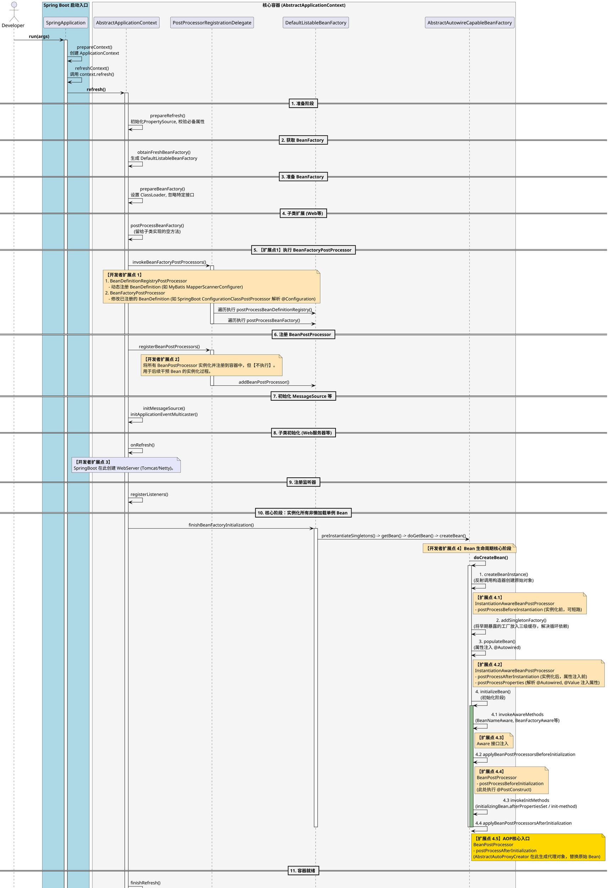

# 1 准备阶段
## 1.1 SpringApplicationRunListener / ApplicationListener
* 触发时机：在 SpringApplication.run() 刚开始，准备环境变量、打印 Banner 时。  
* 核心作用：最早能拦截到启动流程的扩展点。  
* 典型应用：Dubbo 的 DubboSpringApplicationListener 会在这个阶段准备 RPC 
框架的上下文；开发者也可以监听 ApplicationEnvironmentPreparedEvent 来动态
修改启动环境变量（如加密数据库密码解密）。  

# 2 BeanFactory 准备阶段（refresh 内部）
## 2.1 BeanFactoryPostProcessor
* 触发时机：refresh() 中的 invokeBeanFactoryPostProcessors 阶段。此时 Bean 
的定义信息已经加载完毕，但还没有实例化任何 Bean。  
* 核心作用：干预 Bean 的定义。你可以在这里修改 Bean 的属性值、甚至新增/移除 Bean 的注册。  
* 典型应用：
  * Spring Cloud Config 的 EnvironmentRepositoryPropertySourceLocator 
  会在这个阶段读取配置文件，并添加到 Environment 中。    
  * SpringBoot：ConfigurationClassPostProcessor 就是最顶级的 BFPP，它负责解析 
  @Configuration、@Import、@Bean，完成自动装配的核心逻辑。  
  * MyBatis：MapperScannerConfigurer 在这里扫描 Mapper 接口，将接口转化为
  FactoryBean 注册到容器中。  
## 2.2 BeanDefinitionRegistryPostProcessor
* 触发时机：refresh() 中的 invokeBeanFactoryPostProcessors 阶段。此时 Bean 
的定义信息已经加载完毕，但还没有实例化任何 Bean。  
* 核心作用：在 BeanFactoryPostProcessor 之前执行，专门用来向注册中心动态注册新
  的 Bean 定义。  
* 典型应用：Spring Cloud 的 EurekaAutoServiceRegistration 会在这里向容器中注册
  Eureka 服务注册的 Bean。MyBatis 的 Mapper 扫描、SpringCloud OpenFeign 的
  动态代理注册。  
# 3 Bean 实例化阶段（refresh 内部）
## 3.1 InstantiationAwareBeanPostProcessor
* 触发时机：refresh() 中的 finishBeanFactoryInitialization 阶段。
* 核心作用：实例化 Bean 的前后，可以在这里修改 Bean 的属性值。 
* 将 Bean 的创建过程拆分成了三个精细的子扩展点：
  * postProcessBeforeInstantiation：实例化之前。返回非 null 会短路后续正常实例化过程。  
    * 应用：AOP 的 AbstractAutoProxyCreator 会在这里检查是否需要提前代理（处理循环依赖时的早期代理）。
  * postProcessAfterInstantiation：实例化之后，属性注入之前。返回 false 
  会短路 Spring 默认的属性注入逻辑。
  * postProcessProperties / postProcessPropertyValues：属性注入阶段。
    * 应用：Spring 的 @Autowired、@Value 解析注入（AutowiredAnnotationBeanPostProcessor）；MyBatis 的 Mapper 注入。  
## 3.2 Aware 接口群
* 触发时机：initializeBean 阶段的 invokeAwareMethods。
* 核心作用：让 Bean 感知到容器的底层基础设施。
* 典型应用：
  * BeanNameAware：注入 Bean 的名字。
  * ApplicationContextAware：注入整个应用上下文。
  * BeanFactoryAware：注入 BeanFactory。
## 3.3 BeanPostProcessor
它也是两个精细的扩展点，作用于初始化方法前后：
* postProcessBeforeInitialization：在自定义初始化方法（@PostConstruct、InitializingBean）之前执行。
  * 应用：@PostConstruct 的执行逻辑就在 CommonAnnotationBeanPostProcessor 中完成。
* postProcessAfterInitialization：在初始化方法之后执行。
  * 应用：AOP 生成动态代理（AbstractAutoProxyCreator 在这里检查并包装代理对象）；检查 Bean 是否符合特定规范。
## 初始化方法
* @PostConstruct (JSR-250 注解，通过 BPP 解析执行)
* InitializingBean 的 afterPropertiesSet
* 自定义的 init-method (XML/注解配置)
# 4 容器就绪阶段（refresh 结束之后）
## 4.1 Lifecycle / SmartLifecycle
* 触发时机：refresh() 中的 finishRefresh() 阶段。
* 核心作用：管理组件自身的生命周期。
* 典型应用：相比于 ApplicationReadyEvent，SmartLifecycle 提供了更精细的控
制（如 getPhase() 控制启停顺序，stop(Runnable) 支持异步优雅停机）。 
SpringCloud Gateway、Tomcat 的启动与停止都深度绑定了这个接口。  
## 4.2 ApplicationListener / ApplicationEventPublisher
* 触发时机：finishRefresh() 阶段及之后。
* 核心作用：基于事件驱动机制，在特定节点执行扩展逻辑。
* 典型应用：监听 ContextRefreshedEvent（如之前你的 TigerConsumerListener）、
ApplicationReadyEvent（应用彻底就绪后拉起定时任务、发起 MQ 消费）。
