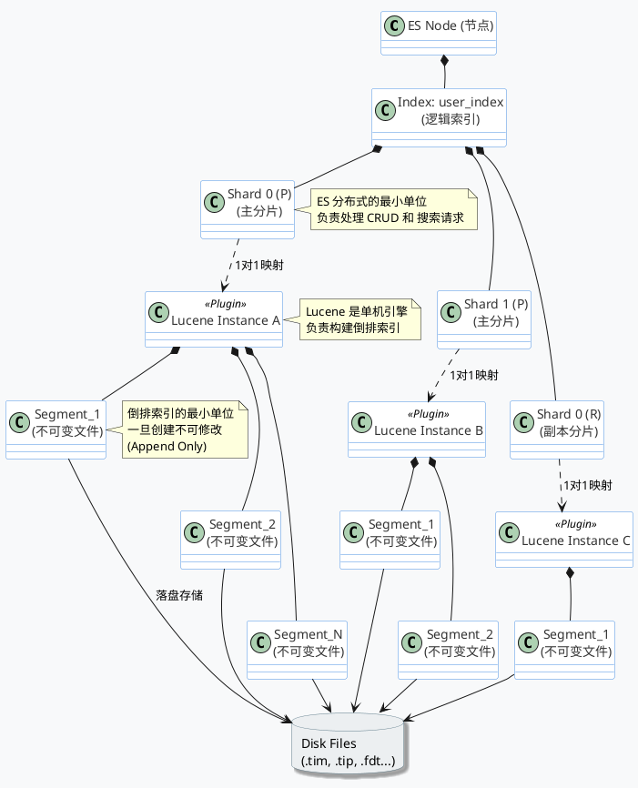

# 总览
elesticsearch 是基于lucene的分布式全文检索引擎，
可以用于全文检索，结构化检索，分析等。  
* 主要的数据结构是LSM Tree  
* 内存排序，磁盘顺序读写  
* 定期磁盘合并整理  
* 追加写入存储，不支持随机写入

```plantuml
@startuml Elasticsearch_Lucene_Pro
' 【必须保留】解决 class 和 database 混合使用的报错
allowmixing

' 【必须保留】Smetana 布局引擎
!pragma layout smetana


' 2. 进阶样式设置 (增加阴影、圆角、数据库样式)
skinparam backgroundColor #F8F9FA
skinparam class {
    BackgroundColor #FFFFFF
    BorderColor #4A90E2
    FontColor #333333
    RoundCorner 5       ' 圆角
    Shadowing true      ' 开启阴影
}
skinparam package {
    BackgroundColor transparent
    BorderColor transparent
    FontStyle plain
}

' 定义一个特殊的样式给 Disk，模拟圆柱体效果
' (Smetana 对 database 关键字支持较好)
skinparam database {
    BackgroundColor #ECEFF1
    BorderColor #607D8B
    Shadowing true
}

' 3. 定义所有元素

' --- 集群层 ---
class "ES Node (节点)" as Node
class "Index: user_index\n(逻辑索引)" as ES_Index
class "Shard 0 (P)\n(主分片)" as Shard_P0
class "Shard 1 (P)\n(主分片)" as Shard_P1
class "Shard 0 (R)\n(副本分片)" as Shard_R0

' --- 引擎层 ---
' 给 Lucene 实例加上不同的背景色，区分层级
class "Lucene Instance A" as Lucene_A <<Plugin>>
class "Segment_1\n(不可变文件)" as Seg1
class "Segment_2\n(不可变文件)" as Seg2
class "Segment_N\n(不可变文件)" as SegN

class "Lucene Instance B" as Lucene_B <<Plugin>>
class "Segment_1\n(不可变文件)" as SegB1
class "Segment_2\n(不可变文件)" as SegB2

class "Lucene Instance C" as Lucene_C <<Plugin>>
class "Segment_1\n(不可变文件)" as SegC1

' --- 存储层 ---
' 使用 database 关键字，Smetana 会渲染成圆柱体
database "Disk Files\n(.tim, .tip, .fdt...)" as Disk

' 4. 布局辅助线 (不可见，强制顺序)
Node -[hidden]-> ES_Index
ES_Index -[hidden]-> Shard_P0
Shard_P0 -[hidden]-> Shard_P1
Shard_P1 -[hidden]-> Shard_R0

Lucene_A -[hidden]-> Seg1
Seg1 -[hidden]-> Seg2
Seg2 -[hidden]-> SegN

Lucene_B -[hidden]-> SegB1
SegB1 -[hidden]-> SegB2

Lucene_C -[hidden]-> SegC1

' 5. 连接关系

' 包含关系
Node *-- ES_Index
ES_Index *-- Shard_P0
ES_Index *-- Shard_P1
ES_Index *-- Shard_R0

Lucene_A *-- Seg1
Lucene_A *-- Seg2
Lucene_A *-- SegN

Lucene_B *-- SegB1
Lucene_B *-- SegB2

Lucene_C *-- SegC1

' 映射关系
Shard_P0 ..> Lucene_A : 1对1映射
Shard_P1 ..> Lucene_B : 1对1映射
Shard_R0 ..> Lucene_C : 1对1映射

' 存储关系
Seg1 --> Disk : 落盘存储
Seg2 --> Disk
SegN --> Disk
SegB1 --> Disk
SegB2 --> Disk
SegC1 --> Disk

' 6. 注释
note right of Shard_P0
  ES 分布式的最小单位
  负责处理 CRUD 和 搜索请求
end note

note right of Lucene_A
  Lucene 是单机引擎
  负责构建倒排索引
end note

note right of Seg1
  倒排索引的最小单位
  一旦创建不可修改
  (Append Only)
end note

@enduml
```

